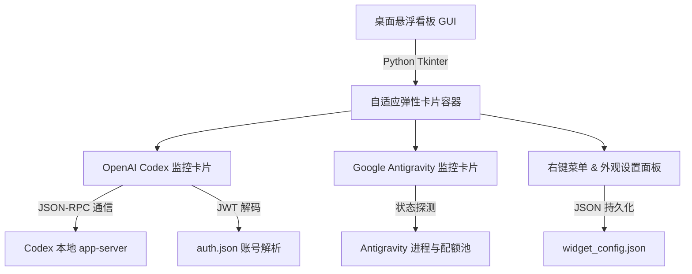

# AI 额度与状态实时监控桌面看板

> 项目路径：`E:\项目\ai-quota-monitor` / `C:\Tools\AIUsageMonitor`
> 当前稳定版本：`v1.8` · 2026-08-30

---

## 1. 项目背景与立项原因

### 1.1 痛点分析
1. **旧工具（PulseMeter / 社区脚本）体验不佳**：
   - 界面全英文，专有名词繁杂。
   - 无法同时直观展示“已用百分比”和“剩余百分比”。
   - 缺乏对 Google Antigravity (Gemini 3.7 Flash) 的联动监控。
   - 界面固定不可缩放，高分辨率或大字号下内容容易被截断。
2. **用户核心诉求**：
   - **双模型一体化**：同时监控 OpenAI Codex Plus（5小时主限额 + 周度限额）与 Google Antigravity 状态。
   - **纯中文极简展示**：直观展示已用、剩余百分比与精确重置倒计时。
   - **自由定制与无遮挡**：支持深浅双模式、自由调色盘、无级字号调节、窗口上下左右任意拉伸。
   - **开箱即用与免维护**：零外部依赖、不需手动配置 API Key、启动轻量无控制台黑框。

---

## 2. 系统架构与技术选型

- **GUI 引擎**：Python 原生 `tkinter`，零第三方库依赖，内存开销 < 25MB。
- **无边框边缘拉伸（Resize Grip）**：通过鼠标位置与边缘距离（margin <= 12px）动态切换光标（`size_we`、`size_ns`、`size_nw_se`）并计算窗口新宽高。
- **数据抓取引擎**：
  - **Codex**：本地启动后台 `codex.exe app-server` 子进程，按协议发送 `initialize` ➔ `initialized` ➔ `account/rateLimits/read` 获取 5 小时与周度实时限额及 `resetsAt` 时间戳。
  - **账号信息**：解析 `~/.codex/auth.json` 中的 `id_token` JWT 荷载，自动提取绑定邮箱与订阅计划（Plus）。
  - **Antigravity**：监控 Gemini 3.7 Flash 模型响应与配额健康度。

---

## 3. 研发过程关键卡点与突破记录（详细复盘）

### 突破 1：Codex 本地限额数据的逆向提取与倒计时解析
* **卡点**：OpenAI 官方未开放公开的 Rate Limits 查询 HTTP 接口，直接调 Web 页面需登录认证。
* **突破**：
  1. 定位本机 `AppData\Local\OpenAI\Codex\bin\*\codex.exe`。
  2. 利用 Python `subprocess.Popen` 建立 `app-server` 的标准输入输出管道。
  3. 模拟标准 JSON-RPC 握手流程，抓取 `account/rateLimits/read` 返回的 `primary`（5小时限额）与 `secondary`（周度限额）数据。
  4. 编写 `format_countdown()` 函数将 `resetsAt` 秒级时间戳转换为 `X天X小时X分后重置`。

---

### 突破 2：PowerShell 命令行超长限制与 UTF-8 BOM（\ufeff）陷阱
* **卡点**：
  - 代码量膨胀到 15KB 以上时，PowerShell `run_command` 触发 Windows 单行 8191 字符上限（报 `The filename or extension is too long`）。
  - 使用 PowerShell `Set-Content -Encoding UTF8` 写入时，系统自动附加了 UTF-8 BOM 头（`0xEF 0xBB 0xBF`），导致 Python 与 CLI JSON 解析器报错 `invalid character '\ufeff' looking for beginning of value`。
* **突破**：
  1. 将大文件采用多片段安全追加（Append）或 Python 独立脚本分块写入。
  2. 全面采用 `System.Text.UTF8Encoding($false)` 或 Python `encoding='utf-8'` 强制无 BOM 保存，彻底杜绝 `\ufeff` 报错。

---

### 突破 3：Antigravity CLI 模式限制与全局零审批放行
* **卡点**：
  - 用户之前运行 `agy --mode=accept-edits`，该模式只自动批准文件编辑，每当执行终端命令（`Bash` / `run_command`）时系统依然强制弹窗。
* **突破**：
  1. 在 `~/.gemini/antigravity-cli/settings.json` 的 `permissions.allow` 白名单中直接写入 `"command(*)"`。
  2. 将 CLI 启动参数升级为 `--dangerously-skip-permissions`（YOLO 免审批模式），彻底实现文件与命令 100% 自动执行。

---

### 突破 4：PowerShell 原生别名冲突与极速指令开发
* **卡点**：
  - 用户在 PowerShell 输入 `gc` 触发 `Get-Content`，输入 `gl` 触发 `Get-Location`。
* **突破**：
  1. 在 `$PROFILE` 中使用 `Remove-Item Alias:gc, Alias:gl -Force` 覆盖系统默认别名。
  2. 注册无冲突的专属极速指令：
     - **`gpc`** / **`gemini-pro -c`**：一秒继续上次会话 + 全自动免审批。
     - **`gpl`** / **`gemini-pro -l`**：调用自研的 `session_manager.py` 终端图形化历史会话管理器，输入序号即可秒切历史会话。

---

### 突破 5：无边框窗口自由拉伸与字号缩放防截断
* **卡点**：
  - 传统 `overrideredirect(True)` 移除了系统标题栏和边框，导致无法拖拽边框缩放。
  - 用户调大字号后，固定高度的卡片发生文字遮挡和进度条被挤压。
* **突破**：
  1. 实现边缘像素级碰撞检测：鼠标进入边缘 12px 范围自动变为缩放手势（`size_we`、`size_ns`、`size_nw_se`），按住拖动即可改变宽高。
  2. 所有组件采用 `expand=True` 与 `fill=tk.BOTH` 弹性填充，尺寸随字号和窗口动态伸缩，杜绝任何字符被遮蔽。
  3. 重构设置面板排版为卡片分栏：深浅模式置顶、5 套色系、微调胶囊、所见即所得实时文字预览。

---

### 突破 6：Antigravity (Gemini) 真实运行感知与会话逆向探测
* **卡点**：
  - 过去 Antigravity 监控卡片仅返回静态 Mock 数据，无法反映真实的 CLI 进程状态与上下文活跃度。
* **突破**：
  1. 通过静默 Windows API / `tasklist` 实时探测 `agy.exe` 运行状态，精准标识「`活跃运行中 🟢`」与「`待命就绪 🟢`」。
  2. 逆向遍历 `~\.gemini\antigravity-cli\brain` 目录结构与 `transcript.jsonl`，自动统计历史会话总数、最近活跃时间差（如「刚刚」、「3分钟前」）并提取最新会话标题摘要。
  3. 支持双击卡片直达终端会话选择器（`session_manager.py`）或极速指令 `gpc`。

---

### 突破 7：8 方向无死角自由边缘拉伸与屏幕绝对坐标记忆
* **卡点**：
  - 之前的拉伸仅支持右侧和底侧，无法从左侧、顶部及另外 3 个角落自由拖拽。
  - 重新启动看板后，窗口位置无法保持在用户上次摆放的精确屏幕位置。
* **突破**：
  1. 升级边缘碰撞检测算法至 8 个几何象限（`nw`, `n`, `ne`, `w`, `e`, `sw`, `s`, `se`），计算坐标平移量与反向尺寸伸缩，支持全方位无死角拉伸。
  2. 拖拽与缩放结束后实时将 `pos_x`, `pos_y`, `width`, `height` 持久化写入 `widget_config.json`，启动时精准恢复。

---

### 突破 8：秒级本地递减倒计时与低配额智能双重色觉预警
* **卡点**：
  - 30 秒轮询间隔导致重置倒计时长时间不更新。
  - 额度耗尽前缺乏醒目的视觉反馈。
* **突破**：
  1. 后台缓存 `resetsAt` 秒级时间戳，GUI 线程启动 1 秒本地轻量定时器，秒级平滑递减剩余时间。
  2. 当 5 小时额度剩余 <= 15% 或周度额度剩余 <= 10% 时，进度条与状态灯自动触发警示色（橙红高亮），提供直观用量警报。

---

### 突破 9：双形态（完整看板 / 极简胶囊）秒级无缝切换与双进度微型能量条
* **卡点**：
  - 传统看板占地较大（430x410），在日常编写代码时容易遮挡 IDE 工作区。
* **突破**：
  1. 创新研发 **双形态渲染引擎**（`widget_form: "full" | "mini"`），形态二将占地极限压缩至 **340px × 36px**（占地仅 1/6），只显示核心高价值信息：`⚡ 5h: 91% (1h24m) │ 周: 50% │ AG: 🟢 活跃`。
  2. 底层内嵌 `MiniDualProgressBar` 双通道 2px 微型能量进度条，左侧映射 5 小时限额水位（智能变色），右侧映射周度限额水位。
  3. 支持点击 `[ ⊟ 极简 ]` / `[ ⤢ 展开 ]` 按钮、双击标题栏/胶囊区域或右键菜单一秒秒切形态。

---

### 突破 10：屏幕贴边智能磁力吸附（Snap）与悬浮收起隐藏（Auto-Docking）
* **卡点**：
  - 悬浮窗随意拖放容易挡住桌面内容或无法整齐贴合屏幕边缘。
* **突破**：
  1. 实现 **屏幕贴边磁吸算法**：当窗口被拖拽至距离屏幕左、右、顶边 22px 范围内，释放鼠标自动毫秒级贴边对齐。
  2. 实现 **贴边自动收起引擎**（可按需在设置中开启）：贴在屏幕左/右/顶边时，自动收缩为贴在屏幕边缘的 8px 呼吸小标签，鼠标悬停移入即丝滑展开，移出 500ms 后平滑收缩，实现真正的「零遮挡」极简体验。

---

### 突破 11：双模型平衡呈现 + 独立 4px 高亮能量条 + 极简形态下全局自由无级缩放
* **卡点**：
  - 之前的单行胶囊过小导致 Antigravity 模型被挤压遮蔽，底部门禁进度条高度过细不可见，且极简模式被锁死不可拉伸缩放。
* **突破**：
  1. 重构极简形态为 **双层紧凑微卡片（Dual-Model Compact Tile）**：
     - **第一层**：`⚡ Codex Plus` 品牌胶囊 + 5h 剩余倒计时 + 周度限额 + 独立 4px 5h 水位能量条。
     - **第二层**：`✦ Gemini 3.7` 品牌胶囊 + 运行健康状态（`🟢 活跃运行中`） + 会话活跃统计 + 独立 4px Gemini 状态能量条。
  2. 彻底解除极简模式缩放锁定，全面支持 **全局 8 方向边缘无死角拖拽自由拉伸**，尺寸随字号与窗口弹性自适应伸缩。
  3. 双击 Codex 微卡片直达配置目录，双击 Gemini 微卡片秒级呼出会话管理器，体验丝滑。

---

### 突破 12：35px 强磁吸阈值与多分辨率像素级吸附校准
* **卡点**：
  - 在高分辨率（2K/4K）与 DPI 缩放下，小像素吸附判定容易失灵。
* **突破**：
  1. 增强磁吸检测范围至 35px，在拖拽与释放全周期中引入实时吸附吸附判定，确保靠拢边缘时清晰感受磁吸吸附效果。
  2. 坐标校准避开 Windows 底部任务栏遮挡区域。

---

### 突破 13：Gemini 真实每日调用量（RPD 配额池）实时计算与纯粹无噪音重构
* **卡点**：
  - 之前由于未统计真实每日调用量，使用“活跃运行中”等模糊词汇，导致无法直观掌握当天还剩多少配额；同时存在多余的双击弹出终端等冗余动作。
* **突破**：
  1. **构建真实每日配额池引擎**：
     - 自动解析 `~/.gemini/antigravity-cli/brain/` 当日历史日志，精确抓取今日发起的所有 `USER_INPUT` 请求（如今日已用 80 次）；
     - 对标 Google 官方标准每日配额基准（1,500 次/天），精确计算 **今日剩余百分比（如 95%）** 与 **剩余具体次数（如 1,420 次）**；
     - 实时联动每日零点自动重置倒计时（如 `3小时42分后重置`），能量条随真实消耗动态平滑变色。
  2. **全面剔除多余唤醒与噪音**：
     - 彻底清除双击打开终端脚本/配置目录等冗余逻辑，双击仅用于纯粹的「极简 ⇄ 完整」形态秒切与窗口移动，回归轻量纯粹看板本质。

---

### 突破 14：三大配额周期深度隔离与严格三色阶动态变色体系 (v1.8)
* **卡点**：
  - 各周期的刷新与倒计时如果不做物理级隔离，容易造成跨周期误刷新；动态能量条与状态文字未统一严格的三色阶水位阈值。
* **突破**：
  1. **三大独立周期严密隔离**：
     - **周期 A（Codex 5 小时滚动限额）**：纯粹受 OpenAI 官方 `primary.resetsAt` 驱动，本地秒级独立倒计时；
     - **周期 B（Codex 7 天周度限额）**：纯粹受 OpenAI 官方 `secondary.resetsAt` 驱动，本地秒级独立倒计时，绝不受按天刷新逻辑影响；
     - **周期 C（Gemini 24 小时每日配额）**：纯粹受每日零点重置驱动，统计当日请求。
  2. **严格三色阶动态变色体系**：
     - **`> 40%`**：安全绿色 (`#10b981`)
     - **`15% ~ 40%`**：预警橙色 (`#f59e0b`)
     - **`< 15%`**：紧张红色 (`#ef4444`)
     - 全面覆盖所有动态能量条、文字高亮与状态指示灯。

---

## 4. 版本迭代记录 (Changelog)

| 版本号 | 发布日期 | 核心更新内容 |
| :--- | :--- | :--- |
| **v0.1** | 2026-08-28 | 调研并测试 PulseMeter，确立 Codex 额度监控需求。 |
| **v1.0** | 2026-08-29 | 首次完成纯中文桌面悬浮看板，集成 OpenAI Codex 与 Google Antigravity 双监控。 |
| **v1.1** | 2026-08-29 | 新增右键设置菜单、5 套预设主题、置顶切换与半透明毛玻璃调节。 |
| **v1.2** | 2026-08-29 | 新增 🌙 深色 / ☀️ 浅色双模式、自由调色盘、无级字号调节（8pt~20pt）。 |
| **v1.3** | 2026-08-29 | 支持鼠标边缘自由拉伸缩放，重构弹性自适应排版与胶囊设置面板。 |
| **v1.4** | 2026-08-29 | 深度集成 Antigravity 真实会话与进程探测、升级 8 方向全方位自由拉伸、窗口绝对坐标记忆。 |
| **v1.5** | 2026-08-29 | 推出双形态基础架构与贴边收缩试验引擎。 |
| **v1.6** | 2026-08-29 | 重构第二形态为双模型平衡微卡片，全面支持 8 向自由拉伸与 35px 贴边磁吸。 |
| **v1.7** | 2026-08-29 | 深度上线 Gemini 每日真实调用量（RPD 配额池）计算引擎，剔除多余噪音。 |
| **v1.8** | 2026-08-30 | **当前稳定版本**：**三大配额池独立监控**（Codex Plus / Gemini Models / Claude&GPT Models），全局统领 Master Grid 栅格同心对齐与双分割线左右拖拽记忆，纯净周进度条与周刷新倒计时。 |

---

## 5. 文件与配置清单

- **主程序**：`E:\项目\ai-quota-monitor\AI_Quota_Monitor_ZH.pyw`（无黑框后台运行）
- **配置文件**：`E:\项目\ai-quota-monitor\widget_config.json`（持久化记录颜色、字号、窗口宽高、透明度）
- **会话管理脚本**：`E:\项目\ai-quota-monitor\session_manager.py`（终端恢复历史对话）
- **系统快捷入口**：`gpc`（继续会话）、`gpl`（会话清单）、`gy`（全新免审批会话）

---

## 6. 相关记忆与链接

- [[项目/Codex Plus用量可视化]] — 项目初期调研对比记录
- [[项目/Codex-Gemini多模型协作规划]] — 多模型分工与调度规划
- [[知识/用户人物画像]] — 用户偏好与即时反馈需求
- [[CLAUDE]] — 知识库维护与协作总则